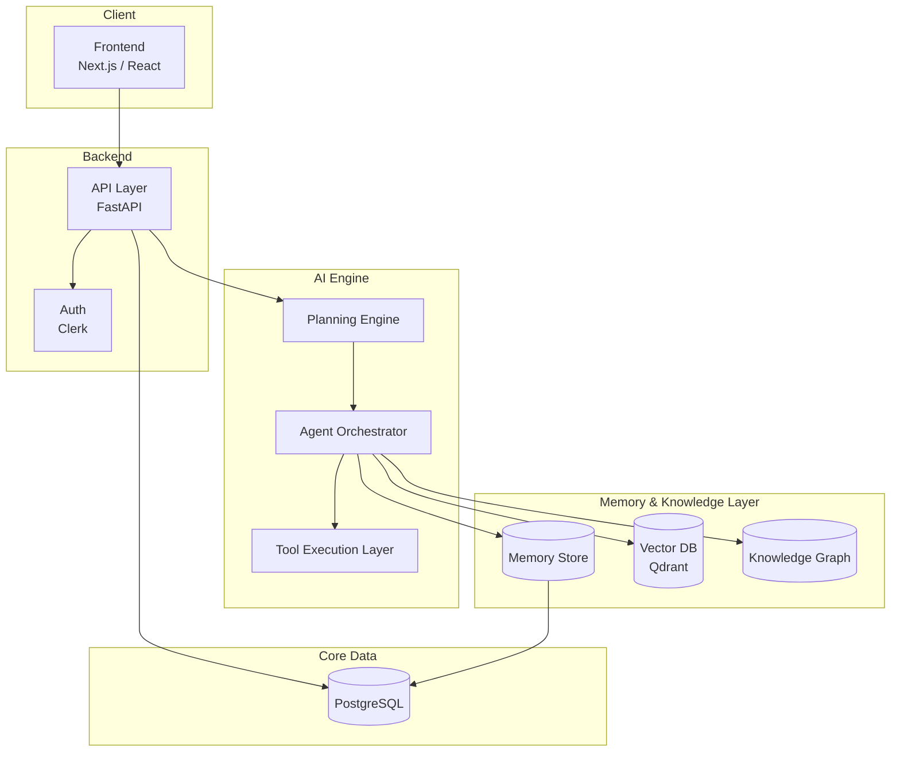

# Architecture

This document describes the planned high-level architecture for AYRN. It intentionally omits implementation detail — no code, no schemas — since the system is still in the design phase. Its purpose is to establish service boundaries and data flow so that later implementation phases have a shared reference.

## System Overview

## Layers

### Frontend

Next.js/React application responsible for task submission, agent monitoring, memory inspection, and (eventually) workspace and marketplace UI. Communicates with the backend exclusively through the API layer — no direct access to the AI engine or data stores.

### Backend (API Layer)

FastAPI service that mediates all client requests. Responsibilities:

- Authentication and session handling (via Clerk)
- Request validation and routing to the AI engine
- Persisting task, user, and workspace records to PostgreSQL
- Exposing status and history endpoints for the frontend

The API layer is intentionally kept thin — it does not itself perform reasoning or planning; it delegates to the AI engine.

### AI Engine

The core of AYRN. Three sub-components:

- **Planning Engine** — decomposes a submitted task into a sequence (or graph) of steps, and revises that plan as execution proceeds. What `roadmap.md` calls "Reasoning" (Phase 5) is this component's plan-revision capability maturing — it is not a separate architectural component.
- **Agent Orchestrator** — manages the lifecycle of one or more agents executing against a plan, including handoff between specialized agents.
- **Tool Execution Layer** — the only component permitted to invoke external tools/APIs on behalf of an agent. Enforces permissioning and logs every call.

### Memory & Knowledge Layer

- **Memory Store** — durable, per-agent and per-user memory, backed by PostgreSQL for structured records.
- **Vector Database (Qdrant)** — semantic memory and retrieval; stores embeddings for memory records and ingested documents.
- **Knowledge Graph** — structured relationships between entities, used alongside vector retrieval for grounded, attributable answers (RAG).

### APIs

Two API surfaces are planned:

1. **Public/Client API** — consumed by the frontend, versioned, documented for external developers once the platform opens up.
2. **Internal Agent API** — the contract between the backend and the AI engine; not exposed externally.

### Authentication

Clerk handles identity, session management, and (later) workspace-level role-based access control. Auth state is validated at the API layer before any request reaches the AI engine.

### Databases

- **PostgreSQL** — system of record for users, workspaces, tasks, agent configurations, and structured memory.
- **Qdrant** — vector store for semantic search over memory and knowledge documents.

Both are treated as independently scalable services; the API layer and AI engine access them through defined interfaces rather than direct coupling.

### Deployment

- **Docker** — all services containerized for local development and CI.
- **Vercel** — frontend hosting.
- **AWS (future)** — backend, AI engine, and database hosting once the platform needs to scale beyond a single-region deployment.

### Future Scaling

Planned scaling considerations, to be revisited as usage grows:

- Horizontal scaling of the Tool Execution Layer, since tool calls are the most latency- and reliability-sensitive path
- Sharding or read-replicas for PostgreSQL once workspace/task volume grows
- Regional deployment of Qdrant to reduce retrieval latency for geographically distributed teams
- Separating the Agent Orchestrator into its own scalable service once multi-agent workloads are common, rather than colocating it with the Planning Engine

## Explicit Non-Goals (Day 1)

- No implementation code, database schemas, or API contracts are finalized in this document.
- No decision has been made yet on message-queue technology for agent-to-agent communication; this will be evaluated in Phase 3.
- Failure/retry semantics for individual plan steps (required by `requirements.md`) are not yet designed at the architecture level. This needs an answer before Phase 3 implementation begins, not after.
